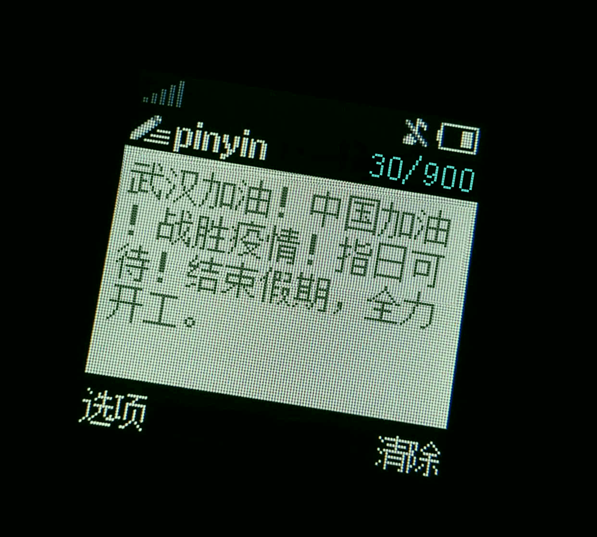

\#\#\#\#\#\#\#\#\#\#\#\#\#\#\#\#\#\#\#\#\#\#\#\#\#\#\#\#\#\#\#\#\#\#\#\#\#\#\#\#\#\#\#\#\#\#\#\#\#\#\#\#\#\#\#
<br>\#                                                                                                          \#<br>
<br>\#   从原作者Fork而来的 [dcalsky/zzkia](https://github.com/dcalsky/zzkia), 感谢原创, 基于原创做了修改和补充.      2020-0202 Beijing,China.               \#<br>
<br>\#                                                                                                           \#<br>
<br>\#\#\#\#\#\#\#\#\#\#\#\#\#\#\#\#\#\#\#\#\#\#\#\#\#\#\#\#\#\#\#\#\#\#\#\#\#\#\#\#\#\#\#\#\#\#\#\#\#\#\#\#\#\#\#\#<br>
<!--注释，不会在浏览器中显示。-->
[^_^]:
    1
[>_<]:
    2
[>_>]:
    3
# ZZKIA

Generate the old Nokia message screenshot.

## DEMO

Demo site: https://zzkia.noddl.me:8020

Demo picture: 

## Development

WEB CONTAINER IS RUNNING ON THE **5003** PORT.

Dev Mode(Server and web client will be hot-reload):

```
$ docker-compose up
```

Prod Mode:

```
$ docker-compose -f docker-compose.prod.yaml up -d
```
#参考资料
[markdown代码中怎样隐藏某行文字，使不渲染出来?](https://www.cnblogs.com/yangzhou33/p/8438461.html)

